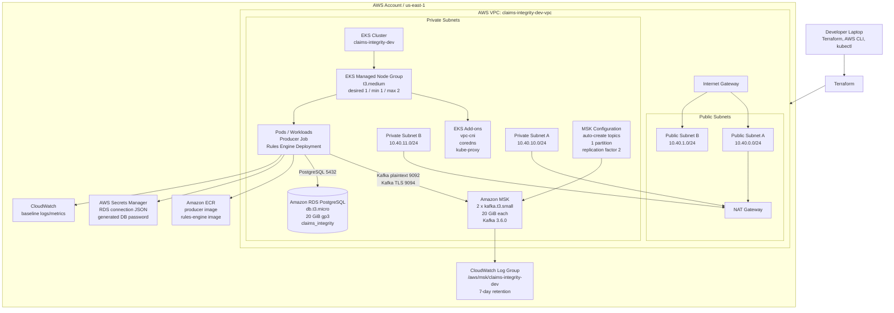

# Phase 1 Infrastructure Diagram

```mermaid
flowchart TB
    Dev[Developer Laptop<br/>Terraform, AWS CLI, kubectl] --> TF[Terraform]

    TF --> VPCBox[AWS VPC<br/>10.40.0.0/16]

    subgraph AWS[AWS Account / us-east-1]
        subgraph VPCBox[AWS VPC: claims-integrity-dev-vpc]
            IGW[Internet Gateway]

            subgraph Public[Public Subnets]
                Pub1[Public Subnet A<br/>10.40.0.0/24]
                Pub2[Public Subnet B<br/>10.40.1.0/24]
                NAT[NAT Gateway]
            end

            subgraph Private[Private Subnets]
                Priv1[Private Subnet A<br/>10.40.10.0/24]
                Priv2[Private Subnet B<br/>10.40.11.0/24]

                EKSCP[EKS Cluster<br/>claims-integrity-dev]
                EKSNG[EKS Managed Node Group<br/>t3.medium<br/>desired 1 / min 1 / max 2]
                Addons[EKS Add-ons<br/>vpc-cni<br/>coredns<br/>kube-proxy]
                Apps[Pods / Workloads<br/>Producer Job<br/>Rules Engine Deployment]
                MSK[Amazon MSK<br/>2 x kafka.t3.small<br/>20 GiB each<br/>Kafka 3.6.0]
                MSKConfig[MSK Configuration<br/>auto-create topics<br/>1 partition<br/>replication factor 2]
                RDS[(Amazon RDS PostgreSQL<br/>db.t3.micro<br/>20 GiB gp3<br/>claims_integrity)]
            end

            IGW --> Pub1
            IGW --> Pub2
            Pub1 --> NAT
            Priv1 --> NAT
            Priv2 --> NAT

            EKSCP --> EKSNG
            EKSNG --> Addons
            EKSNG --> Apps
            MSKConfig --> MSK

            Apps -->|Kafka plaintext 9092<br/>Kafka TLS 9094| MSK
            Apps -->|PostgreSQL 5432| RDS
        end

        ECR[Amazon ECR<br/>producer image<br/>rules-engine image]
        Secrets[AWS Secrets Manager<br/>RDS connection JSON<br/>generated DB password]
        CW[CloudWatch<br/>baseline logs/metrics]
        MSKLogs[CloudWatch Log Group<br/>/aws/msk/claims-integrity-dev<br/>7-day retention]
    end

    Apps --> ECR
    Apps --> Secrets
    Apps --> CW
    MSK --> MSKLogs
```
